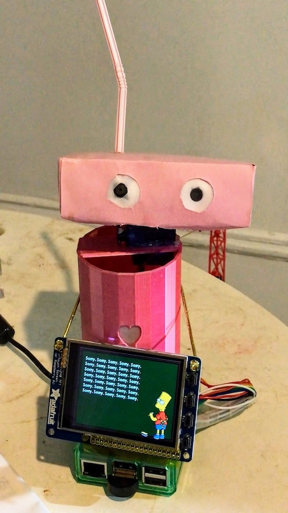

# ohgee

The OhGee Cloud Services Avatar

A robot that understand speech and face sentiment; it nods, speaks and uses an RGB LED heart to interact with observers.

Ohgee performs local motion detection, sound detection and speech synthesis.

When motion is detected, images are sent to the [Google Cloud Vision service](https://cloud.google.com/vision/) for object detection and labelling.

When sound is detected, the audio stream is sent to the [Google Cloud Speech-to-Text service](https://cloud.google.com/speech-to-text/) for speech recognition.

Any speech transcript returned by the speech service is sent to the [Google Cloud Natural Language service](https://cloud.google.com/natural-language/) for analysis.

Analyzed speech is examined for known key phrases and patterns to which Ohgee selects a random response from an associated set of responses.

Analyzed images are checked for some known labels, if any of those labels are present, Ohgee responds with both incredible wit and tact!
The analyzed images are examined for faces - if any faces are found, Ohgee elides each face with a smiley illustrating their detected sentiment.
If a face is "close enough" Ohgee greets the person and bid them farewell when they depart.

Click on the image to see a quick demo...
[{:height="720px"}](https://youtu.be/PBYmpuFzArQ "Ohgee demo")

But wait... there's more!

Since visual and audible "noise" varies widely based on location, Ohgee establishes background levels for sound and motion when starting up.

Ohgee also updates from github at startup and restarts if network connectivity is lost.

Want to know more about any of this? Look at the code!
